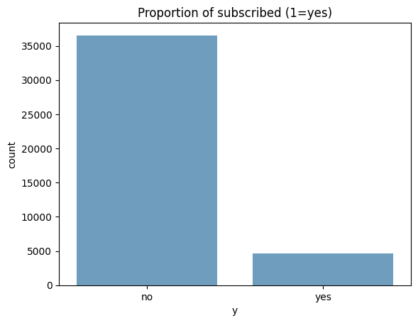
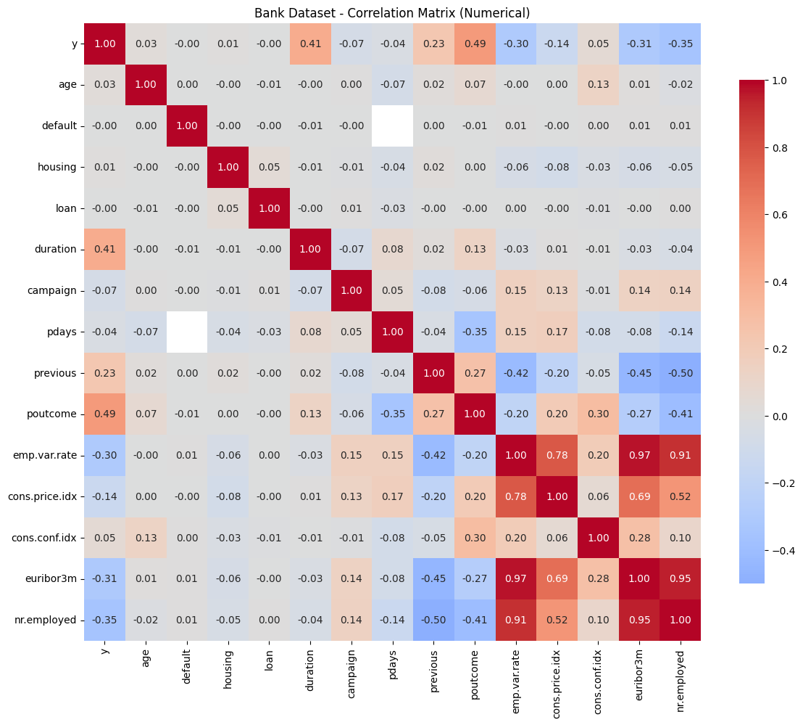
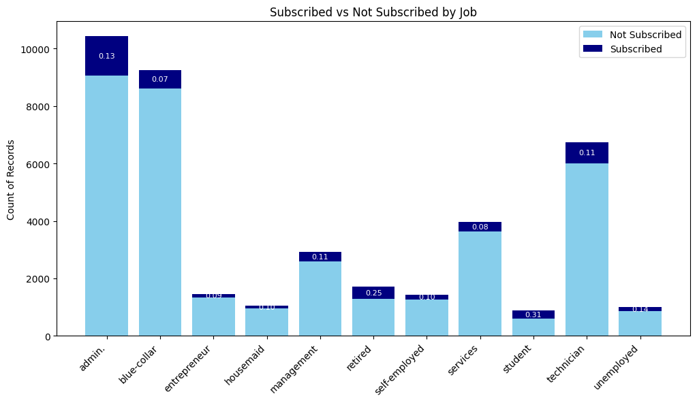
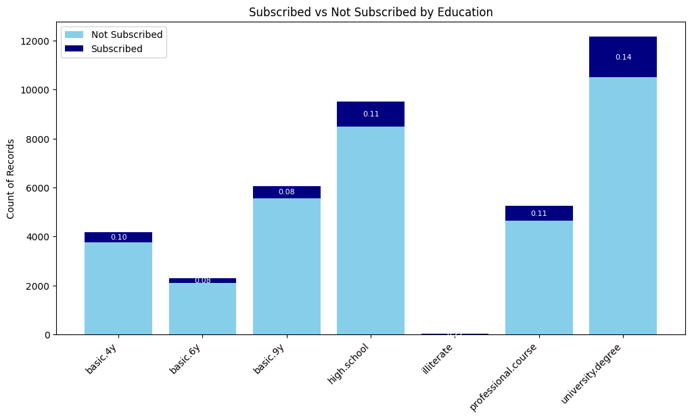

## Assumptions
* I am only using "bank additional". This is from 2014, not 2011. The documentation states this is an enriched version of bank-full.

# EDA
### Some key findings
There are other artifacts I need to address:
* The target variable is unbalanced.
* Many features are colinear
* booleans are coded as yes/no/unknown
* `pdays` uses 999 as an unknown
* `job` and `education` both are multiclass variables with 5+ classes. `contact` only has two classes. But these classes can be combined
* `default`, `housing`, `loan` have null values
* Many of the economic variables are colinear
* `poutcome` and `pdays` have >85% null values
* `campaign` is a skewed distribution
* Time values like `month` and `day` are strings

# Algorithm Selection

### Dataset Characteristics
* 40,000 rows (n). A large dataset. 
* This is a supervied learning task.
* 19 features (p). 16 numeric (continuous + binary) and 3 multiclass. 
* Even if we one-hot encode each multiclass feature, we will have fewer than 40 columns. Therefore n >> p , and the curse of dimensionality is not a large concern. However, if the dataset was fewer than 1000 records, we would need to take this into consideration
* There are co-linear features (e.g our economic indicators) that would not perform in linear models. 
* Our categorical features should be either one-hot encoded or given an ordinal scale (e.g. education: primary < secondary < tertiary) 
  
### Logistic Regression
My first model selection choice would be a logistic regression model. 

**Pros:** LR excels in interpretability: it has clear beta coefficients that indicate feature importance and direction of influence. Since it trains via gradient descent, it performs well on datasets of this size (large, but not so large that partial fits are required). As long as we regularize our features, it will be relatively robust to overfitting. 

**Cons:** Assumes linear relationships between features and log-odds, which means it can miss complex interactions. It is sensitive to outliers and requires feature scaling for optimal performance. It assumes no multicolinearity, so we need to reengineer or combine those variables. 

### Naive Bayes

**Pros:** Naive Bayes performs very well with categorical features and handles mixed data types naturally. It's computationally efficient, requires minimal training data, and is robust to irrelevant features. The algorithm works well with the assumption of feature independence and provides fast predictions, making it suitable for real-time applications.

**Cons:** The strong independence assumption is often violated in practice, particularly problematic when customer characteristics are correlated. Performance can degrade significantly when this assumption is severely violated. Less interpretable than logistic regression for understanding feature importance, which is a strong drawback if we need to explain this to banking regulators. 

### Considering N < 1000
With fewer than 1,000 records, Naive Bayes becomes more attractive. It has minimal data requirements and robustness to small sample sizes, which  make it superior to logistic regression. LR  may suffer from unstable coefficient estimates and can overfit in small datasets. The independence assumption becomes less problematic when data is limited and model complexity must be minimized.

# Preprocessing
### Data Pre-Processing Steps

These are all the steps I would take if I was preparing to use logistic regression:

* Convert time features to cosine (represent cylcical nature of time)
* Turn `education` in to an ordinal feature
* Turn `job` into an ordinal feature
* Turn `campaign` into three buckets: 1, 2, 3+
* Fill nulls in `default`, `housing`, `loan` with `0`. There is a busienss case for this. "1" will represent a known positive: "This person has defaulted on a loan." We can treat a "no" and "unknown" the same.
* Drop `duration` which creates lookahead bias
* Drop `pdays` bc it has more than 90% null values - too null to be useful
* Drop `poutcome`. This is useful for a follow-on model (e.g returning customers. But not for cold-start problem)
* Drop colinear economic outcomes (only keep `nr.employed`,`cons.price.idx`)
* Scale all numeric features to 0-1
* Re-sample training data to show imbalanced y target variable